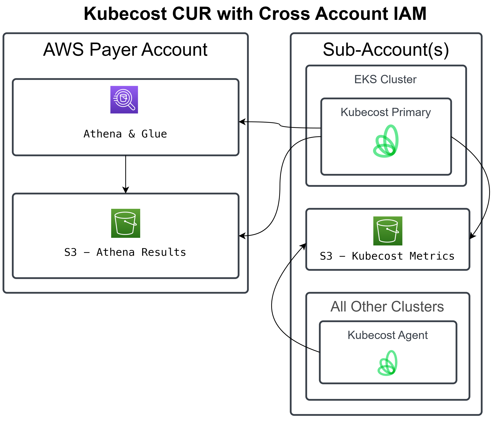

# terraform-aws-kubecost

Terraform module to deploy CUR (Cost Usage Report) and IAM policies so kubecost can access it

## Deployed on payer account

## Deployed on another account on organization

## TO-DO

1. Add kubecost setup as well

## Documentation

- https://github.com/kubecost/docs/blob/main/install-and-configure/install/cloud-integration/aws-cloud-integrations/aws-cloud-integration-using-irsa.md
