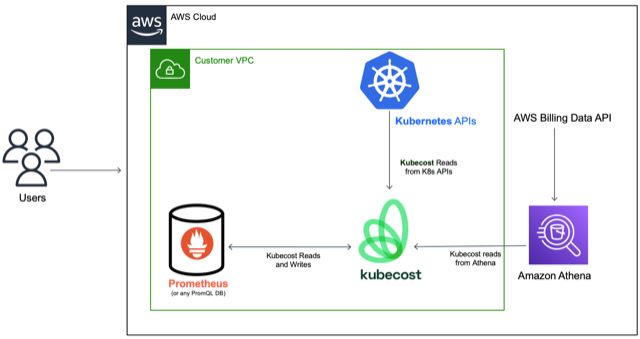

# terraform-aws-kubecost

Terraform module to deploy CUR (Cost Usage Report) and IAM policies so kubecost can access it.

When you first create the Athena table and the CUR report definition, Amazon adds a cloudformation to the S3 bucket
that has to be applied manually. This cloudformation (`crawler-cfn.yml`) adds a lambda to invoke Athena on every change of the
S3 bucket, among other resources. This part is already done by this Terraform as well, so no need
to do this manually.

## Deployed on payer account

## Deployed on another account on organization

## TO-DO

1. Add kubecost setup as well

## Documentation

- https://github.com/kubecost/docs/blob/main/install-and-configure/install/cloud-integration/aws-cloud-integrations/aws-cloud-integration-using-irsa.md
- https://medium.com/arcesium-engineering-blog/better-aws-cost-report-analysis-with-terraform-and-athena-an-infrastructure-as-code-approach-5f9a874c6254
